# TheManager Architecture and End-to-End Flow

> **Document purpose:** Detailed technical architecture, runtime flow, data model, integration contracts, and operational behavior for the TheManager equipment schedule and procurement risk-analysis application.
>
> **Repository:** `TheManager`
>
> **Architecture reviewed:** 2026-09-19
>
> **Status:** Describes the current source tree. Sections marked **Current gap** identify behavior that is implemented in source but not consistently wired into the default startup path.

> **AWS migration note (Phase 0, 2026-09-19):** The product is named **TheManager**. The current runtime described below is still the Azure baseline. The future AWS target is documented in [`infrastructure/README.md`](./infrastructure/README.md); no production workload has moved yet.

> **Migration implementation status (Phase 1 source, 2026-09-19):** CDK now defines encrypted S3 report storage, DynamoDB state tables, Aurora PostgreSQL Serverless v2/Data API, Secrets Manager credentials, Cognito, and agent execution observability. These resources are synthesized and unit-tested but deliberately not deployed until an AWS account, region, budget owner, and deployment approval are supplied. The live progress record is [`MIGRATION_PROGRESS.md`](./MIGRATION_PROGRESS.md).

> **AWS implementation additions:** The repository now also includes a PostgreSQL migration, Data API and DynamoDB adapters, Bedrock structured-supervisor boundary, reusable search/citation service, approval-gated actions, deterministic What-If calculations, EventBridge/Step Functions workflow definitions, S3 DOCX report storage, evaluation fixtures, and the target FastAPI entry point (`python backend/main.py --aws`). These are migration-source assets and do not assert that AWS resources have been deployed or live model access has been granted.

---

## 1. Executive Summary

TheManager is a full-stack AI-assisted risk-analysis application for equipment procurement and project schedules.

The system:

1. Accepts a user question in a Next.js web interface.
2. Sends the question through a Next.js API proxy to a Python FastAPI backend.
3. Maintains a conversational session in memory.
4. Routes the question to one or more Semantic Kernel/Azure AI agents.
5. Reads project, equipment, supplier, purchase-order, and schedule data from SQL Server.
6. Uses Bing grounding for current political, tariff, and logistics research.
7. Logs agent actions and thinking stages to SQL Server.
8. Generates a report document.
9. Uploads the report to Azure Blob Storage.
10. Stores report metadata in SQL Server.
11. Returns the answer and report information to the user interface.

The application also supports an automated scheduled workflow that runs without a browser request and generates a risk report on a daily schedule.

### 1.1 High-level architecture

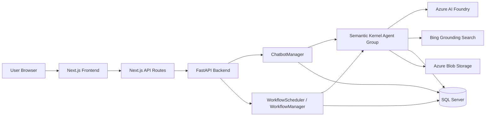

---

## 2. Repository Structure

```text
TheManager/
├── ARCHITECTURE.md
├── frontend/
│   ├── app/
│   │   ├── api/
│   │   │   ├── chat/route.ts
│   │   │   ├── sessions/route.ts
│   │   │   ├── reports/route.ts
│   │   │   ├── heatmap/route.ts
│   │   │   └── thinking-logs/route.ts
│   │   ├── chat/page.tsx
│   │   ├── dashboard/page.tsx
│   │   ├── reports/page.tsx
│   │   ├── thinking-logs/page.tsx
│   │   ├── thinking-logs/[id]/page.tsx
│   │   └── page.tsx
│   ├── components/
│   ├── lib/
│   ├── package.json
│   └── tsconfig.json
├── backend/
│   ├── main.py
│   ├── api/
│   │   ├── app.py
│   │   ├── api_server.py
│   │   └── endpoints.py
│   ├── agents/
│   │   ├── agent_definitions.py
│   │   ├── agent_manager.py
│   │   └── agent_strategies.py
│   ├── config/
│   │   └── settings.py
│   ├── managers/
│   │   ├── chatbot_manager.py
│   │   ├── scheduler.py
│   │   └── workflow_manager.py
│   ├── plugins/
│   │   ├── schedule_plugin.py
│   │   ├── risk_plugin.py
│   │   ├── logging_plugin.py
│   │   ├── political_risk_json_plugin.py
│   │   ├── citation_handler_plugin.py
│   │   └── report_file_plugin.py
│   ├── sql/
│   │   ├── create_table.sql
│   │   ├── create_stored_procedure.sql
│   │   └── ...
│   └── requirements.txt
└── ...
```

### 2.1 Source of truth by concern

| Concern | Primary source |
|---|---|
| Frontend routes and screens | `frontend/app/**` |
| Browser-to-backend proxying | `frontend/app/api/**/route.ts` |
| FastAPI application startup | `backend/main.py` |
| Primary FastAPI application | `backend/api/app.py` |
| REST workflow/chat routes | `backend/api/endpoints.py` |
| Session/report/history API implementation | `backend/api/api_server.py` |
| Agent definitions | `backend/agents/agent_definitions.py` |
| Agent routing | `backend/agents/agent_strategies.py` |
| Conversational orchestration | `backend/managers/chatbot_manager.py` |
| Scheduled orchestration | `backend/managers/scheduler.py`, `workflow_manager.py` |
| External integrations | `backend/plugins/**` |
| Runtime configuration | `backend/config/settings.py` |
| Relational data model | `backend/sql/create_table.sql` |
| Schedule comparison calculation | `backend/sql/create_stored_procedure.sql` |

---

## 3. Technology Stack

### 3.1 Frontend

| Area | Technology |
|---|---|
| Framework | Next.js 15.3.1 |
| UI runtime | React 18 |
| Language | TypeScript |
| Styling | Tailwind CSS 4 |
| UI components | Radix UI, Semantic UI-style components |
| Chat rendering | `react-markdown`, `remark-gfm`, `rehype-raw` |
| Maps | `react-simple-maps` |
| Tables | `@tanstack/react-table` |
| Animation | `framer-motion` |
| Notifications | `sonner` |

### 3.2 Backend

| Area | Technology |
|---|---|
| API | FastAPI |
| ASGI server | Uvicorn |
| AI orchestration | Semantic Kernel |
| Azure agent service | `azure-ai-projects` |
| Azure authentication | `azure-identity` |
| Database driver | `pyodbc` |
| Data processing | Pandas |
| Blob storage | `azure-storage-blob` |
| Report generation | Spire.Doc, `python-docx`, Markdown conversion |
| Configuration | `python-dotenv` |

### 3.3 External services

| Service | Responsibility |
|---|---|
| Azure AI Foundry | Agent project and model deployment |
| Azure AI model deployment | Natural-language reasoning and response generation |
| Bing Grounding/Search | Current political, tariff, customs, and logistics research |
| Microsoft SQL Server | Operational data, schedule data, event logs, thinking logs, report metadata |
| Azure Blob Storage | Generated report document storage |

---

## 4. Runtime Topology

### 4.1 Development topology

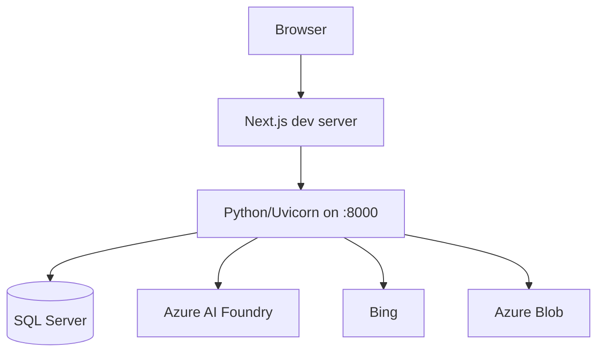

Expected process model:

```text
Frontend: npm run dev
Backend:  python backend/main.py
Backend:  http://localhost:8000
Frontend: Next.js local development URL, normally http://localhost:3000
```

### 4.2 Backend startup modes

`backend/main.py` supports three modes:

| Command | Behavior |
|---|---|
| `python main.py` | Starts the FastAPI/Uvicorn API on port 8000 |
| `python main.py --workflow-only` | Executes one workflow and exits |
| `python main.py --scheduler-only` | Starts the scheduler without the HTTP API |

### 4.3 Current gap: two FastAPI applications

The repository contains two separate FastAPI app implementations:

1. `backend/api/app.py`
2. `backend/api/api_server.py`

`backend/main.py` imports:

```python
from api.app import app
```

Therefore, the default startup path runs `backend/api/app.py`.

`backend/api/app.py` provides:

```text
POST /chat
POST /workflow/run
GET  /workflow/status
GET  /risks/summary
GET  /schedule/comparison
WebSocket /chat
```

`backend/api/api_server.py` provides the `/api/*` endpoints expected by the frontend:

```text
POST /api/chat
GET  /api/sessions
GET  /api/session-ids
GET  /api/sessions/{session_id}
GET  /api/thinking-logs
GET  /api/thinking-log-ids
GET  /api/thinking-logs-by-session-id/{session_id}
GET  /api/heatmap
GET  /api/reports
```

These applications are not currently consolidated. A production-ready deployment should use one FastAPI application or explicitly mount both route sets into one application.

---

## 5. Frontend Architecture

### 5.1 Page map

```mermaid
flowchart TD
    Root[/]
    Chat[/chat]
    Dashboard[/dashboard]
    Reports[/reports]
    Logs[/thinking-logs]
    LogDetail[/thinking-logs/:id]

    Root --> Chat
    Chat --> Dashboard
    Chat --> Reports
    Chat --> Logs
    Logs --> LogDetail
```

| Page | Purpose |
|---|---|
| `/` | Redirects the user to the chat experience |
| `/chat` | Main conversational risk-analysis interface |
| `/dashboard` | Risk/map dashboard |
| `/reports` | Generated report listing and metadata |
| `/thinking-logs` | Agent execution and thinking-log list |
| `/thinking-logs/[id]` | Detailed log view for a selected session |

### 5.2 Next.js API proxy

The browser generally calls same-origin Next.js routes. Those routes then call the Python backend. This avoids exposing backend connection details directly to browser code and centralizes the backend URL.

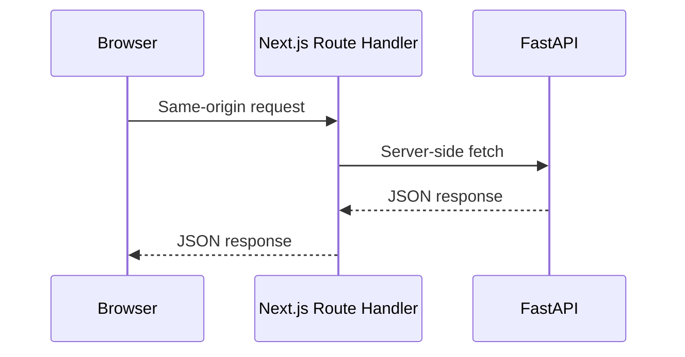

Main proxy routes:

| Next.js route | Backend dependency |
|---|---|
| `/api/chat` | Chat endpoint |
| `/api/sessions` | Session history endpoints |
| `/api/reports` | Report metadata endpoint |
| `/api/heatmap` | Political risk heatmap endpoint |
| `/api/thinking-logs` | Thinking-log endpoints |

### 5.3 Chat UI flow

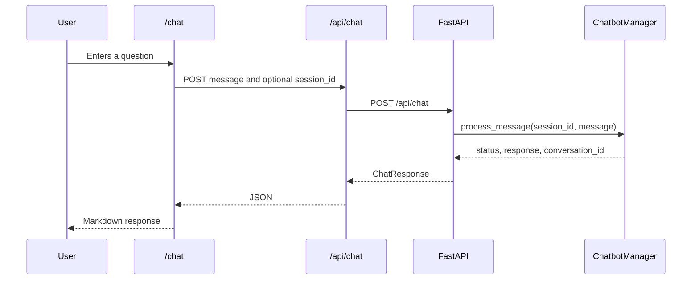

The chat interface supports:

- New session creation.
- Reusing an existing session ID.
- Markdown responses.
- Tables and code blocks.
- Session history selection.
- Copying assistant responses.
- Links to reports, dashboards, and thinking logs.

---

## 6. Backend Component Architecture

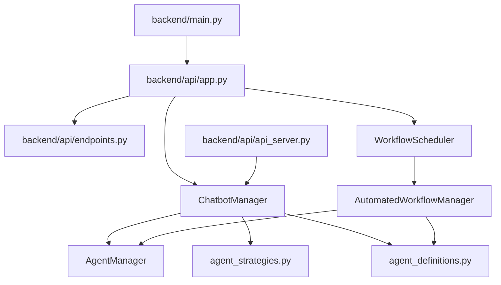

### 6.1 `ChatbotManager`

`backend/managers/chatbot_manager.py` is the primary conversational orchestration component.

Responsibilities:

- Create and manage chat sessions.
- Create Azure AI project/client objects.
- Create Semantic Kernel agents.
- Register plugins.
- Create and maintain agent-group conversations.
- Route user questions using agent strategy logic.
- Process agent events.
- Persist event and thinking logs.
- Return the final response to the API layer.
- Clean up stale sessions.

Runtime session state is held in memory. SQL Server stores history, but does not replace the in-memory live agent object.

### 6.2 `WorkflowScheduler`

`backend/managers/scheduler.py` handles scheduled execution.

Responsibilities:

- Maintain the scheduled workflow loop.
- Run the configured daily workflow.
- Support immediate execution.
- Start and stop the scheduler thread.

The scheduler runs in a background thread and periodically checks whether the scheduled execution time has arrived.

### 6.3 `AutomatedWorkflowManager`

`backend/managers/workflow_manager.py` performs the non-interactive workflow.

Typical workflow:

```text
Create workflow/session identifiers
    ↓
Create Scheduler Agent
    ↓
Create Reporting Agent
    ↓
Create AgentGroupChat
    ↓
Run schedule analysis
    ↓
Run report generation
    ↓
Create DOCX file
    ↓
Upload report to Azure Blob
    ↓
Persist report metadata
    ↓
Return workflow result
```

---

## 7. AI Agent Architecture

### 7.1 Agent inventory

Agents are declared in `backend/agents/agent_definitions.py`.

| Agent | Responsibility | Main inputs | Main outputs |
|---|---|---|---|
| Scheduler Agent | Compare planned and equipment milestone dates | SQL schedule data | Schedule variance and risk data |
| Political Risk Agent | Assess geopolitical and political risk | Manufacturing/destination data, web search | Political risk analysis and citations |
| Tariff Risk Agent | Assess tariffs, customs, and trade risks | Supplier/country/product context, web search | Tariff and trade-risk analysis |
| Logistics Risk Agent | Assess transportation and route risks | Shipping and logistics data, web search | Logistics risk analysis |
| Reporting Agent | Combine findings and create final report | Schedule and specialized risk outputs | Markdown report, DOCX report |
| Assistant Agent | Answer general questions | User message | Conversational response |

### 7.2 Agent routing

Routing is implemented in `backend/agents/agent_strategies.py`.

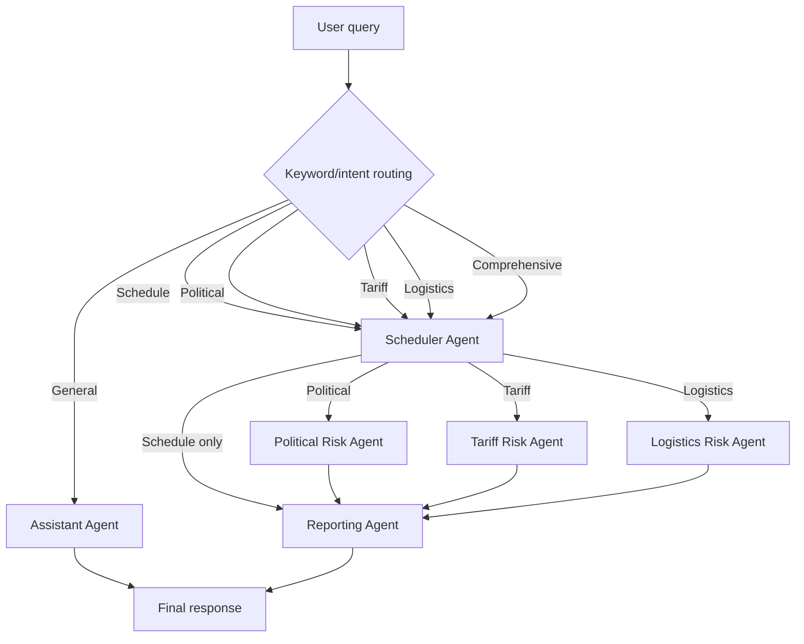

Example routing:

| Query | Expected path |
|---|---|
| “Show the equipment schedule risks” | Scheduler → Reporting |
| “What political risks affect this equipment?” | Scheduler → Political → Reporting |
| “Check tariffs for the supplier country” | Scheduler → Tariff → Reporting |
| “Analyze shipping delays” | Scheduler → Logistics → Reporting |
| “Give me a complete risk report” | Scheduler → Political → Tariff → Logistics → Reporting |
| “What does this application do?” | Assistant |

The current strategy is keyword-oriented. It should be treated as deterministic routing rather than a fully independent intent-classification model.

---

## 8. Plugin Architecture

Plugins provide the agents with database, calculation, logging, citation, and document-generation capabilities.

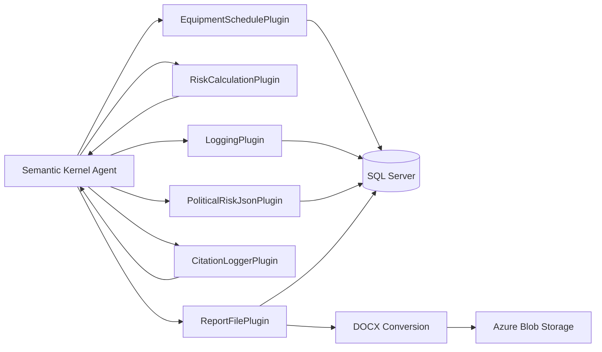

### 8.1 EquipmentSchedulePlugin

File: `backend/plugins/schedule_plugin.py`

Responsibilities:

- Open a SQL Server connection.
- Execute the schedule comparison stored procedure.
- Return equipment, project, milestone, planned date, and equipment milestone date data.
- Provide schedule risk summary data.
- Support optional equipment and project filtering.

Primary database operation:

```sql
EXEC sp_GetScheduleComparisonData
```

### 8.2 RiskCalculationPlugin

File: `backend/plugins/risk_plugin.py`

Responsibilities:

- Calculate schedule risk percentages.
- Apply risk thresholds.
- Categorize equipment as low, medium, or high risk.

The documented calculation is:

```text
risk_percent =
    days_variance / days_until_p6_due * 100
```

Thresholds:

```text
Low:    risk_percent < 5%
Medium: 5% <= risk_percent < 15%
High:   risk_percent >= 15%
```

### 8.3 LoggingPlugin

File: `backend/plugins/logging_plugin.py`

Logs:

- User queries.
- Agent actions.
- Agent outputs.
- Thinking stages.
- Errors.
- Agent IDs.
- Model deployment names.
- Thread IDs.
- Session IDs.
- Conversation IDs.

Primary tables:

- `dim_agent_event_log`
- `dim_agent_thinking_log`

### 8.4 PoliticalRiskJsonPlugin

File: `backend/plugins/political_risk_json_plugin.py`

Responsibilities:

- Parse political risk Markdown output.
- Convert tables into structured JSON.
- Extract or retain citations.
- Persist structured political risk data.

### 8.5 CitationLoggerPlugin

File: `backend/plugins/citation_handler_plugin.py`

Responsibilities:

- Read citation annotations from Azure AI agent threads.
- Format citations as Markdown.
- Append a `References` section to reports.

### 8.6 ReportFilePlugin

File: `backend/plugins/report_file_plugin.py`

Responsibilities:

1. Receive Markdown report content.
2. Create a temporary document source.
3. Convert Markdown content to DOCX.
4. Upload the DOCX to Azure Blob Storage.
5. Persist report metadata in `fact_risk_report`.
6. Return the report URL and metadata.

If Blob Storage is unavailable, the implementation can fall back to a local file URL. That fallback should be treated as a development convenience, not a durable production-storage strategy.

---

## 9. End-to-End Interactive Chat Flow

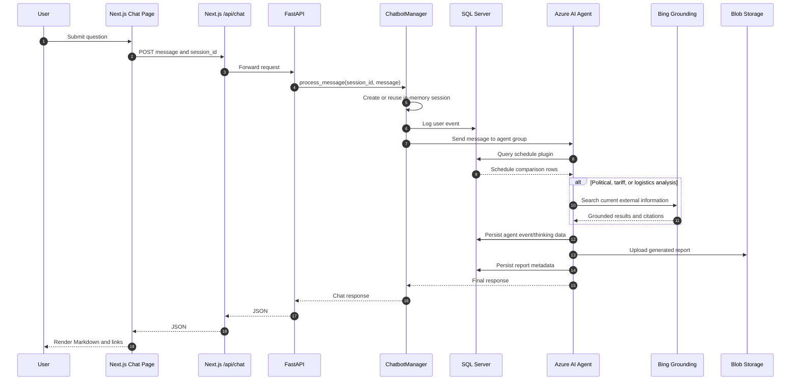

### 9.1 Session lifecycle

1. The client sends a message without a session ID.
2. The API creates a UUID session ID.
3. A `ChatbotManager` is allocated for that session.
4. The manager creates/reuses its agent group and conversation.
5. The response includes the session ID.
6. The frontend sends the same session ID for follow-up messages.
7. The manager keeps the live session in the process memory.
8. Event and thinking history is persisted to SQL.
9. On shutdown or timeout, sessions are cleaned up.

### 9.2 Timeout behavior

The alternative API server wraps message processing in a 300-second timeout.

On timeout:

- The active session manager is removed.
- The client receives an HTTP 504 response.
- The user must retry the request, potentially with a new session.

---

## 10. End-to-End Automated Workflow Flow

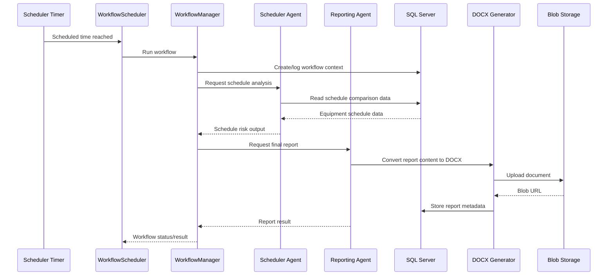

The workflow can be triggered by:

- The daily scheduler.
- `POST /workflow/run`.
- `python main.py --workflow-only`.

---

## 11. HTTP and WebSocket API Surface

### 11.1 Primary application routes

Defined by `backend/api/endpoints.py` and included by `backend/api/app.py`.

| Method | Path | Purpose | Current status |
|---|---|---|---|
| `POST` | `/chat` | REST chat request | Implemented |
| `POST` | `/workflow/run` | Run workflow immediately | Implemented |
| `GET` | `/workflow/status` | Read latest workflow status | Placeholder: returns “Not implemented yet” |
| `GET` | `/risks/summary` | Return risk summary | Implemented through plugin |
| `GET` | `/schedule/comparison` | Return schedule comparison | Implemented through plugin |
| `WebSocket` | `/chat` | Interactive WebSocket chat | Implemented |

### 11.2 Frontend-oriented API routes

Defined in `backend/api/api_server.py`.

| Method | Path | Purpose |
|---|---|---|
| `POST` | `/api/chat` | Chat request with optional session |
| `GET` | `/api/sessions` | Full session and conversation history |
| `GET` | `/api/session-ids` | Session list summary |
| `GET` | `/api/sessions/{session_id}` | One session’s conversations |
| `GET` | `/api/thinking-logs` | Thinking-log records |
| `GET` | `/api/thinking-log-ids` | Thinking-log session list |
| `GET` | `/api/thinking-logs-by-session-id/{session_id}` | Thinking logs for a session |
| `GET` | `/api/heatmap` | Country risk heatmap data |
| `GET` | `/api/reports` | Generated report metadata |

### 11.3 Chat request/response contract

Request:

```json
{
  "session_id": "optional-session-uuid",
  "message": "Show me the highest-risk equipment"
}
```

Response shape:

```json
{
  "status": "success",
  "response": "Markdown response text",
  "session_id": "session-uuid"
}
```

Error response:

```json
{
  "detail": "Error processing chat request: ..."
}
```

### 11.4 Report response contract

```json
{
  "session_id": "session-uuid",
  "blob_url": "https://storage-account.blob.core.windows.net/...",
  "filename": "risk-report.docx",
  "report_type": "comprehensive",
  "created_date": "2026-09-19T..."
}
```

---

## 12. SQL Server Data Model

### 12.1 Entity relationship overview

```mermaid
erDiagram
    DIM_PROJECT ||--o{ FACT_PURCHASE_ORDER : has
    DIM_PROJECT ||--o{ FACT_P6_SCHEDULE : has
    DIM_PROJECT ||--o{ FACT_EQUIPMENT_MILESTONE_SCHEDULE : has
    DIM_WORK_PACKAGE ||--o{ FACT_PURCHASE_ORDER : groups
    DIM_WORK_PACKAGE ||--o{ FACT_P6_SCHEDULE : groups
    DIM_WORK_PACKAGE ||--o{ FACT_EQUIPMENT_MILESTONE_SCHEDULE : groups
    DIM_EQUIPMENT ||--o{ FACT_PURCHASE_ORDER : ordered
    DIM_EQUIPMENT ||--o{ FACT_P6_SCHEDULE : planned
    DIM_EQUIPMENT ||--o{ FACT_EQUIPMENT_MILESTONE_SCHEDULE : delivered
    DIM_MILESTONE ||--o{ FACT_P6_SCHEDULE : defines
    DIM_MILESTONE ||--o{ FACT_EQUIPMENT_MILESTONE_SCHEDULE : defines
    DIM_SUPPLIER ||--o{ FACT_PURCHASE_ORDER : receives
    DIM_SUPPLIER ||--o{ DIM_EQUIPMENT_SUPPLIER : supplies
    DIM_EQUIPMENT ||--o{ DIM_EQUIPMENT_SUPPLIER : sourced
    DIM_EQUIPMENT ||--o{ DIM_MANUFACTURING_LOCATION : manufactured
    DIM_EQUIPMENT ||--o{ DIM_LOGISTICS_INFO : shipped
    DIM_AGENT_EVENT_LOG ||--o{ FACT_RISK_REPORT : references
```

### 12.2 Dimension tables

#### `dim_project`

Stores project identity and project geography.

Key fields:

- `project_id`
- `project_code`
- `project_name`
- `project_country`
- `project_location`

#### `dim_work_package`

Stores work-package and WBS information.

Key fields:

- `work_package_id`
- `work_package_code`
- `work_package_name`
- `wbs`

#### `dim_equipment`

Stores equipment identity and specifications.

Key fields:

- `equipment_id`
- `equipment_code`
- `equipment_name`
- `equipment_type`
- `specifications`

#### `dim_milestone`

Stores milestone activities and descriptions.

Key fields:

- `milestone_id`
- `milestone_number`
- `milestone_activity`
- `milestone_description`

#### `dim_supplier`

Stores supplier identity and contact information.

Key fields:

- `supplier_id`
- `supplier_number`
- `supplier_name`
- `contact_name`
- `contact_number`
- `email_address`

#### `dim_equipment_supplier`

Associates equipment with suppliers and sourcing details.

Key fields:

- `equipment_supplier_id`
- `equipment_id`
- `supplier_id`
- `unit_cost`
- `is_preferred`
- `lead_time_days`
- `remarks`

#### `dim_manufacturing_location`

Stores equipment manufacturing locations.

Key fields:

- `manufacturing_location_id`
- `equipment_id`
- `supplier_id`
- `location_address`

#### `dim_logistics_info`

Stores shipment and route details.

Key fields:

- `logistics_info_id`
- `equipment_id`
- `supplier_id`
- `logistics_method`
- `shipping_port`
- `receiving_port`

### 12.3 Fact tables

#### `fact_purchase_order`

Stores purchase-order lines connecting projects, work packages, suppliers, and equipment.

Important fields:

- `purchase_order_number`
- `line_item`
- `project_id`
- `work_package_id`
- `supplier_id`
- `equipment_id`
- `amount`

#### `fact_p6_schedule`

Stores planned P6 milestone dates.

Important fields:

- `project_id`
- `work_package_id`
- `equipment_id`
- `milestone_id`
- `p6_schedule_due_date`

#### `fact_equipment_milestone_schedule`

Stores expected equipment milestone completion dates.

Important fields:

- `equipment_id`
- `project_id`
- `work_package_id`
- `milestone_id`
- `purchase_order_id`
- `equipment_milestone_due_date`
- `status`

#### `fact_risk_report`

Stores metadata for generated reports.

Important fields:

- `session_id`
- `conversation_id`
- `filename`
- `blob_url`
- `report_type`
- `created_date`

### 12.4 Agent observability tables

#### `dim_agent_event_log`

Stores event-level records:

- Agent name.
- Event time.
- Action.
- User query.
- Agent output.
- Conversation ID.
- Session ID.

#### `dim_agent_thinking_log`

Stores deeper execution records:

- Agent name.
- Thinking stage.
- Thought content.
- Stage output.
- Agent output.
- Azure agent ID.
- Model deployment name.
- Thread ID.
- Status.
- Session ID.
- Conversation ID.

---

## 13. Schedule and Risk Calculation Flow

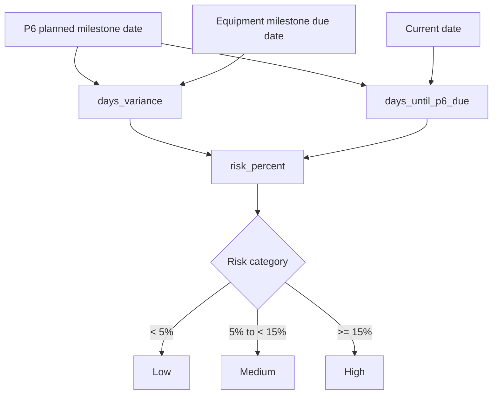

Formula:

```text
days_variance =
    equipment_milestone_due_date - p6_schedule_due_date

days_until_p6_due =
    p6_schedule_due_date - current_date

risk_percent =
    days_variance / days_until_p6_due * 100
```

The raw comparison is produced by `sp_GetScheduleComparisonData`, defined in the SQL scripts under `backend/sql`.

---

## 14. Heatmap Flow

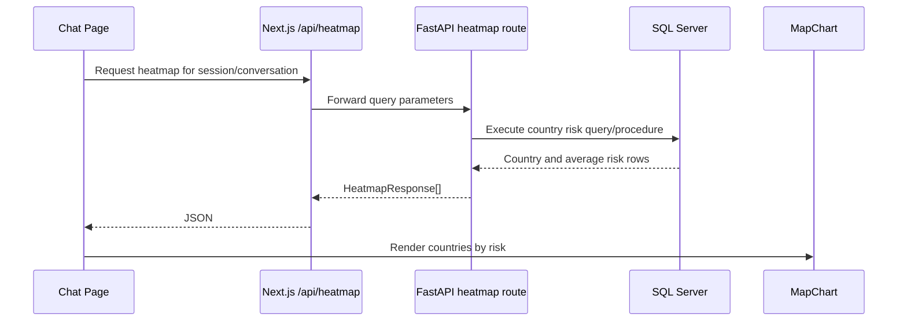

Heatmap data contains:

- Timestamp.
- Conversation ID.
- Session ID.
- Country.
- Average risk.
- Optional breakdown.

---

## 15. Reports and Document Storage Flow

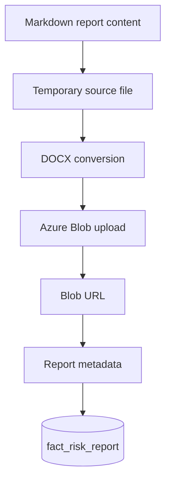

The report metadata allows the frontend to list and link generated documents without storing the binary document in SQL Server.

---

## 16. Configuration and Secrets

Configuration is read in `backend/config/settings.py` and from `.env` through `python-dotenv`.

Expected configuration includes:

```text
DB_CONNECTION_STRING

AZURE_AI_AGENT_PROJECT_NAME
AZURE_AI_AGENT_PROJECT_CONNECTION_STRING
AZURE_AI_AGENT_MODEL_DEPLOYMENT_NAME

BING_SEARCH_API_KEY
BING_CONNECTION_NAME

AZURE_STORAGE_CONNECTION_STRING
AZURE_STORAGE_ACCOUNT_NAME
AZURE_STORAGE_CONTAINER
REPORT_STORAGE_PATH
```

### 16.1 Configuration responsibilities

| Variable group | Used by |
|---|---|
| Database connection | API, schedule plugin, logging, report metadata |
| Azure AI project | Agent initialization and Azure AI threads |
| Model deployment | Scheduler, specialist, assistant, and reporting agents |
| Bing settings | Political, tariff, and logistics research |
| Blob settings | Generated DOCX storage |

Secrets must remain in environment configuration or a secret manager. They must not be committed to source control.

---

## 17. Error and Failure Behavior

### 17.1 API failures

The API can return:

- HTTP 500 for processing or database errors.
- HTTP 504 for chat timeouts.
- Structured `status: error` responses from manager-level processing.

### 17.2 Database failures

Database connection failures affect:

- Schedule retrieval.
- Risk summaries.
- Session history.
- Thinking-log retrieval.
- Report metadata retrieval.
- Event logging.

The API should expose the failure explicitly rather than silently returning empty data.

### 17.3 AI service failures

AI failures can affect:

- Agent initialization.
- Agent message processing.
- Grounding search.
- Citation retrieval.
- Report generation.

The final response should preserve enough context to distinguish an AI failure from a database failure or a storage failure.

### 17.4 Blob storage failures

Blob upload failure may result in:

- A locally generated report URL in development.
- Missing durable report availability in production.

Production deployments should fail visibly or place the report in a durable retry queue when Blob Storage is unavailable.

### 17.5 Session cleanup

Sessions are removed from the in-memory manager on:

- Request timeout.
- Request error.
- Application shutdown.
- Explicit cleanup of stale sessions.

---

## 18. Current Architecture Gaps and Recommended Remediation

### 18.1 Consolidate the FastAPI applications

**Observed issue:** The default process starts `backend/api/app.py`, while the frontend expects routes implemented in `backend/api/api_server.py`.

**Recommended direction:**

1. Select one FastAPI application as the canonical app.
2. Move or include all `/api/*` routes into that app.
3. Keep the workflow and schedule routes available.
4. Add compatibility aliases only where needed.
5. Update frontend proxy routes to the final canonical paths.
6. Add an API health endpoint.

### 18.2 Make session storage explicit

**Observed issue:** Active sessions exist only in process memory.

**Impact:**

- A process restart invalidates active sessions.
- Multiple backend replicas do not share sessions.
- Load balancing requires sticky sessions or shared state.

**Recommended direction:**

- Store durable conversation identity in SQL.
- Use a distributed cache or external session store for active agent state if horizontal scaling is required.
- Define session expiration and recovery behavior.

### 18.3 Improve agent routing

**Observed issue:** Routing is keyword-oriented.

**Recommended direction:**

- Normalize user input before matching.
- Add an explicit intent model or structured routing prompt.
- Define fallback behavior for ambiguous requests.
- Record the selected route in event logs.

### 18.4 Separate domain services from API construction

**Observed issue:** Some API modules instantiate managers and database connections directly.

**Recommended direction:**

```text
API route
    ↓
Application service
    ↓
Domain/plugin service
    ↓
Repository/database adapter
```

This makes testing, dependency injection, and future scaling easier.

### 18.5 Replace scheduler thread polling for production

**Observed issue:** The scheduler uses a background thread and periodic sleeping.

**Recommended direction:**

- Use a managed job scheduler.
- Or use an external scheduler such as Azure Functions Timer Trigger, Container Apps Jobs, or a workflow service.
- Persist workflow status and retry state.
- Use idempotency keys for report generation.

### 18.6 Restrict CORS

`backend/api/app.py` currently allows all origins, methods, and headers.

Production should:

- Allow only the deployed frontend origin.
- Restrict methods to those actually used.
- Restrict headers.
- Review credential behavior.

### 18.7 Implement workflow status

`GET /workflow/status` currently returns a placeholder response.

A complete implementation should expose:

- Workflow ID.
- Start time.
- Completion time.
- Current stage.
- Status.
- Error message.
- Report URL.
- Retry count.

---

## 19. Recommended Canonical Runtime Architecture

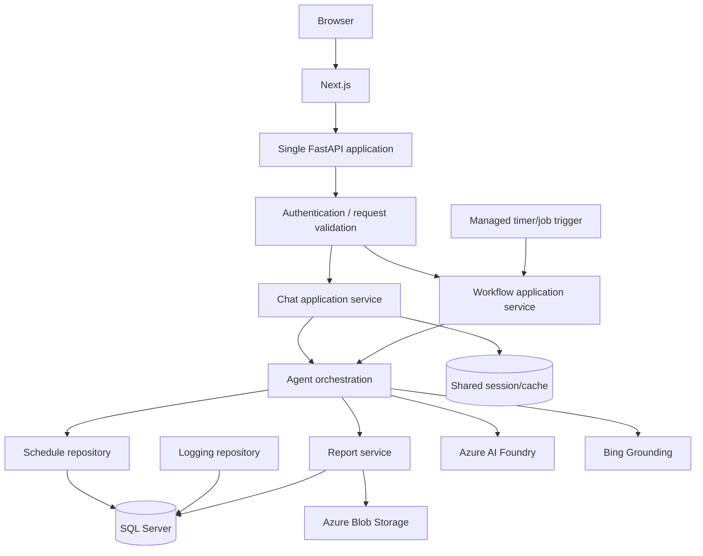

Recommended logical boundaries:

1. **Presentation boundary** — Next.js pages and route handlers.
2. **API boundary** — one FastAPI application and versioned contracts.
3. **Application boundary** — chat and workflow services.
4. **Agent boundary** — agent selection, execution, and event translation.
5. **Domain boundary** — schedule comparison and risk calculation.
6. **Persistence boundary** — SQL repositories and report metadata.
7. **Integration boundary** — Azure AI, Bing, and Blob adapters.

---

## 20. Operational Flows

### 20.1 Browser request flow

```text
Browser
  → Next.js page
  → Next.js route handler
  → FastAPI route
  → ChatbotManager
  → Agent group
  → Plugins and external services
  → SQL/blob persistence
  → FastAPI response
  → Next.js response
  → Browser rendering
```

### 20.2 Daily report flow

```text
Timer
  → WorkflowScheduler
  → WorkflowManager
  → Scheduler Agent
  → SQL schedule comparison
  → Reporting Agent
  → DOCX generation
  → Blob upload
  → SQL report metadata
```

### 20.3 History retrieval flow

```text
History page
  → Next.js history route
  → FastAPI history route
  → SQL event-log query
  → JSON reconstruction
  → React state
  → UI timeline/chat history
```

### 20.4 Thinking-log flow

```text
Agent execution
  → LoggingPlugin
  → dim_agent_thinking_log
  → Thinking-log API
  → Thinking-log page
```

---

## 21. Architecture Invariants

The following behaviors are core to the system and should be preserved during changes:

1. A user can send multiple messages within a session.
2. The session ID remains stable across successful follow-up requests.
3. Schedule analysis reads from SQL Server rather than fabricating schedule data.
4. Political, tariff, and logistics analysis can use current external search data.
5. Agent execution is observable through event and thinking logs.
6. Reports have both a document location and SQL metadata.
7. Automated workflow execution can run without an active browser session.
8. Schedule risk is derived from planned-versus-equipment milestone dates.
9. Frontend pages retrieve data through Next.js server-side proxy routes.
10. Errors from database, AI, timeout, and storage layers must remain distinguishable.

---

## 22. Validation Checklist

Use this checklist when changing the architecture:

- [ ] Does the frontend route call the canonical backend route?
- [ ] Is the route included in the FastAPI application started by `backend/main.py`?
- [ ] Is the session ID preserved across follow-up messages?
- [ ] Are event and thinking logs written with both session and conversation IDs?
- [ ] Does schedule analysis still execute the schedule comparison procedure?
- [ ] Are risk thresholds unchanged unless the requirement explicitly changes?
- [ ] Are citations preserved in research-backed responses?
- [ ] Is report metadata persisted after report generation?
- [ ] Is Blob Storage failure visible to the caller?
- [ ] Can the automated workflow run independently from the browser?
- [ ] Is the workflow status persisted and queryable?
- [ ] Are database and Azure configuration values supplied through environment configuration?
- [ ] Are CORS origins restricted for production?
- [ ] Are API contract changes reflected in both Next.js route handlers and frontend consumers?

---

## 23. Key Files

### Frontend

- [`frontend/app/page.tsx`](./frontend/app/page.tsx)
- [`frontend/app/chat/page.tsx`](./frontend/app/chat/page.tsx)
- [`frontend/app/dashboard/page.tsx`](./frontend/app/dashboard/page.tsx)
- [`frontend/app/reports/page.tsx`](./frontend/app/reports/page.tsx)
- [`frontend/app/thinking-logs/page.tsx`](./frontend/app/thinking-logs/page.tsx)
- [`frontend/app/api/chat/route.ts`](./frontend/app/api/chat/route.ts)
- [`frontend/app/api/sessions/route.ts`](./frontend/app/api/sessions/route.ts)
- [`frontend/app/api/reports/route.ts`](./frontend/app/api/reports/route.ts)
- [`frontend/app/api/heatmap/route.ts`](./frontend/app/api/heatmap/route.ts)
- [`frontend/app/api/thinking-logs/route.ts`](./frontend/app/api/thinking-logs/route.ts)

### Backend

- [`backend/main.py`](./backend/main.py)
- [`backend/api/app.py`](./backend/api/app.py)
- [`backend/api/api_server.py`](./backend/api/api_server.py)
- [`backend/api/endpoints.py`](./backend/api/endpoints.py)
- [`backend/managers/chatbot_manager.py`](./backend/managers/chatbot_manager.py)
- [`backend/managers/scheduler.py`](./backend/managers/scheduler.py)
- [`backend/managers/workflow_manager.py`](./backend/managers/workflow_manager.py)
- [`backend/agents/agent_definitions.py`](./backend/agents/agent_definitions.py)
- [`backend/agents/agent_strategies.py`](./backend/agents/agent_strategies.py)
- [`backend/config/settings.py`](./backend/config/settings.py)

### Plugins

- [`backend/plugins/schedule_plugin.py`](./backend/plugins/schedule_plugin.py)
- [`backend/plugins/risk_plugin.py`](./backend/plugins/risk_plugin.py)
- [`backend/plugins/logging_plugin.py`](./backend/plugins/logging_plugin.py)
- [`backend/plugins/political_risk_json_plugin.py`](./backend/plugins/political_risk_json_plugin.py)
- [`backend/plugins/citation_handler_plugin.py`](./backend/plugins/citation_handler_plugin.py)
- [`backend/plugins/report_file_plugin.py`](./backend/plugins/report_file_plugin.py)

### Database

- [`backend/sql/create_table.sql`](./backend/sql/create_table.sql)
- [`backend/sql/create_stored_procedure.sql`](./backend/sql/create_stored_procedure.sql)

